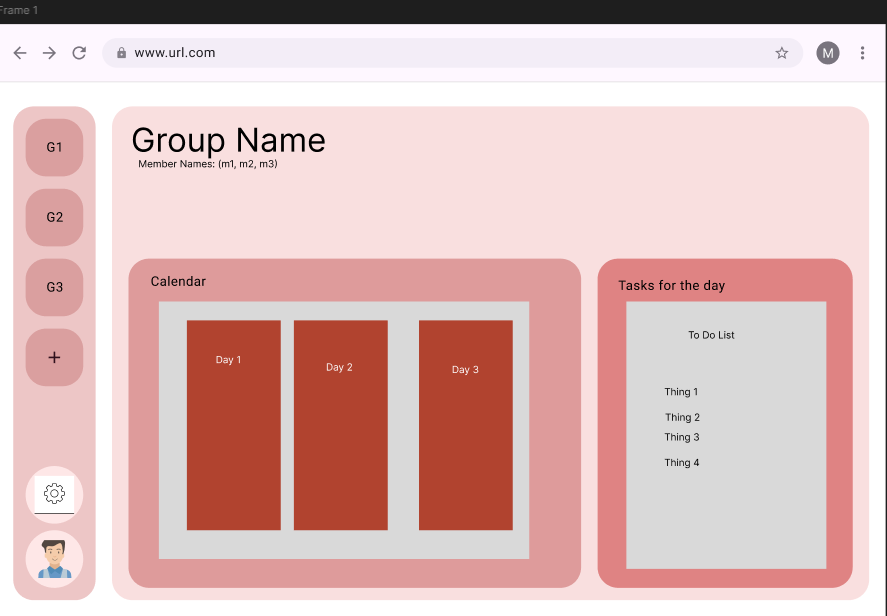
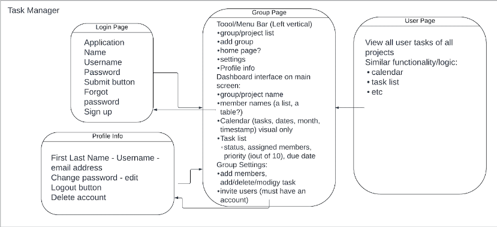

## Project Proposal
Our project is a task manager that has similar core functionalities of modern project management platforms like Atlassian’s Jira. The goal of the application is to provide a comprehensive yet user-friendly solution for individuals and teams to manage their daily tasks efficiently and delegate work across their projects. Users will have full control over their tasks, including the ability to add, edit, and delete tasks, with all changes reflected in both the database and the client side. The client interface will update in real-time, ensuring consistency across all devices.

The application will feature a login page for user authentication and a main dashboard where users can view their task or to-do lists for the day, week, or month. We will also provide a calendar to help users visualize task deadlines. Additionally, users will be able to create group projects and add members to these groups.

Users will have the ability to create teams, allowing multiple users to access and collaborate on a project. Each user can create tasks and assign them to others. Tasks will include attributes such as priority, status, and due dates. Users will also be able to join multiple teams and manage tasks across different projects.

A sidebar will allow users to switch between groups, as well as access a settings page, profile page, and home page.

## Diagrams/Images
**Figma Mockup**
- Website Prototype: 
  - Figma Link: https://www.figma.com/design/FCj4ujNPAujULSoWmLliL5/Untitled?node-id=1-3978&m=dev&t=9FDr9CW5920yrVr6-1
- Website Flowchart: 
  - This flowchart showcases the functionality of the application.

## Frameworks and Technologies
- Express.js, MongoDB, React, JavaScript
